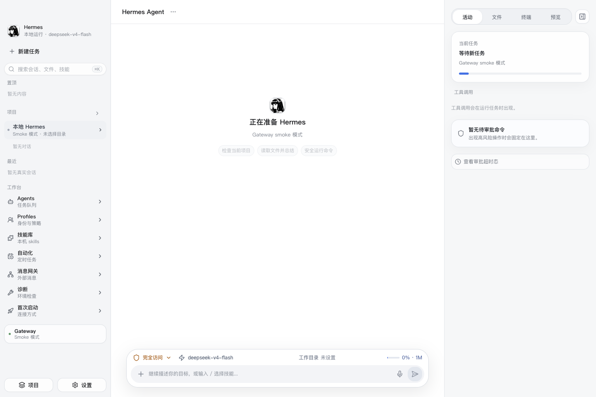
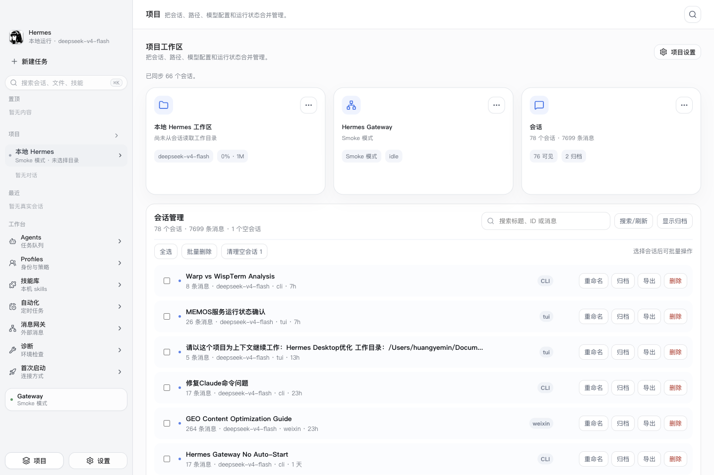
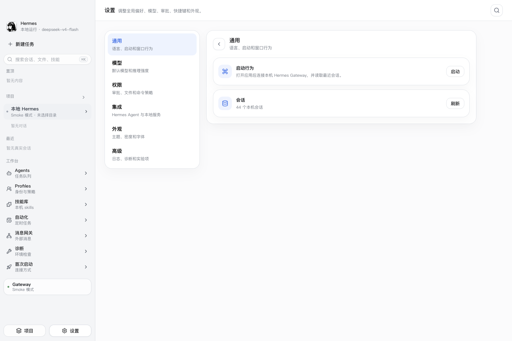
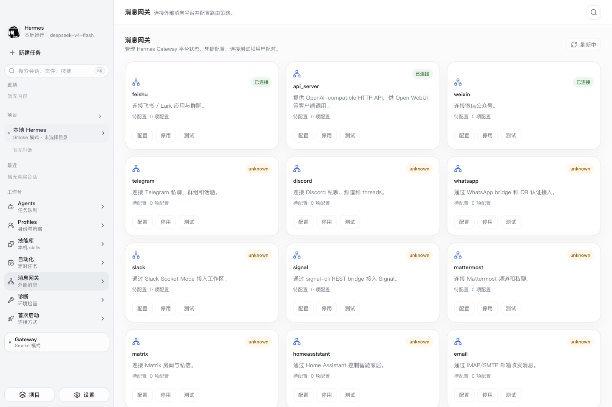
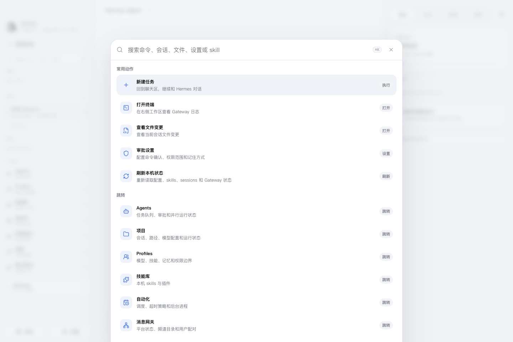

# Beauty Hermes GUI

English | [中文](./README.md)

Beauty Hermes GUI is a desktop workbench for [Hermes Agent](https://github.com/NousResearch/hermes-agent). It does not vendor the official Hermes Agent repository and does not bundle the backend. Instead, it focuses on turning local CLI / Gateway capabilities into a cleaner, more modern desktop experience inspired by Codex Desktop.

Current version: `0.1.1`, part of the `0.x.x` early release line. The priority is to make the macOS and Windows desktop apps usable, visible, and resilient before adding code signing, notarization, auto-update, and deeper production hardening.



## Why This Exists

Hermes Agent is powerful, but day-to-day desktop use can still feel rough:

- Sessions, projects, files, terminals, and approval states are easy to lose track of during long-running tasks.
- Tool calls, reasoning, phase updates, and final answers need clearer visual separation.
- macOS, Windows, WSL, and Python environments behave differently, making Gateway startup issues hard to diagnose.
- Settings, messaging channels, skills, and automation jobs need a stable desktop control surface.
- UI density, spacing, font sizes, and status presentation matter when the app stays open all day.

Beauty Hermes GUI turns Hermes Desktop into an Agent workbench: projects and sessions on the left, conversation and results in the center, activity/files/terminal/preview on the right.

## Highlights

- **Codex-like desktop shell**: three-column layout, low-noise status, light controls, and work-friendly spacing.
- **Readable message rendering**: human messages on the right, agent messages on the left, with tool calls, reasoning, phase updates, and final answers separated.
- **Project and session management**: pinned items, project groups, recent sessions, archive/delete actions, and quick navigation.
- **Collapsible right workbench**: activity, files, terminal, and preview panels without permanently stealing chat space.
- **Local Hermes bridge**: reads local config, profiles, skills, sessions, cron jobs, messaging state, and diagnostics where available.
- **Gateway adapter**: supports local Gateway, remote Gateway, Windows native Hermes, and WSL Hermes.
- **Deep settings pages**: models, permissions, integrations, appearance, and advanced controls.
- **Windows CI verification**: GitHub Actions `windows-latest` builds the portable Windows app, launches the packaged `.exe` in smoke mode, and uploads an artifact.

## Screenshots

### Chat And Workbench


The bottom Composer keeps permission, model, working directory, context progress, and attachment controls in one place. The right workbench shows activity, tool calls, and approvals.

### Project Workspace



Projects group paths, sessions, model configuration, and runtime state instead of dumping every conversation into one flat list.

### Settings



Settings cover models, permissions, integrations, appearance, and advanced configuration, backed by the Electron bridge where local Hermes data is available.

### Messaging Gateway



The messaging page is designed for Telegram, Feishu/Lark, WeChat, and other channel configuration and status surfaces.

### Command Center



The command center provides fast navigation, file opening, workbench switching, approval access, and common actions.

## Installation

### Windows

The Windows app is currently distributed through GitHub Actions artifacts:

1. Open the repository **Actions** page.
2. Open the latest successful **Windows Build** workflow.
3. Download the `Beauty-Hermes-GUI-windows` artifact.
4. Unzip the downloaded artifact, then unzip `Beauty-Hermes-GUI-0.1.1-windows-x64.zip` inside it.
5. Run `Beauty Hermes GUI.exe`.

The Windows build is verified on GitHub Actions `windows-latest` with:

- `npm ci`
- Windows native / WSL environment adapter smoke
- portable Windows packaging
- packaged `.exe` launch smoke
- artifact upload

If Windows SmartScreen warns about an unknown publisher, it is because the `0.x.x` line is not commercially code-signed yet. After confirming the artifact comes from this repository's GitHub Actions run, choose "More info" to continue.

### macOS

The macOS app can currently be packaged locally:

```bash
git clone https://github.com/baileyh8/Beauty-Hermes-GUI.git
cd Beauty-Hermes-GUI
npm ci
BEAUTY_HERMES_RELEASE_DIR=release/mac npm run dist:mac
```

On Apple Silicon, this usually creates:

```bash
open "release/mac/Beauty Hermes GUI-darwin-arm64/Beauty Hermes GUI.app"
```

You can also copy it to `/Applications`:

```bash
cp -R "release/mac/Beauty Hermes GUI-darwin-arm64/Beauty Hermes GUI.app" /Applications/
```

On Intel Macs, replace `arm64` with `x64`. The `0.x.x` line is not notarized yet. If Gatekeeper blocks the app, right-click and open it, or remove the quarantine attribute after verifying the source.

## Connecting Hermes Agent

Beauty Hermes GUI connects to or starts Hermes Gateway:

- Local Hermes CLI: `hermes dashboard --no-open --host 127.0.0.1 --port ...`
- Remote Gateway: connect through a configured Gateway URL.
- Windows native: detects `HERMES_CLI`, PATH, `~/.local/bin/hermes.exe`, `%APPDATA%\Python\Python311\Scripts\hermes.exe`, and related paths.
- WSL: starts Hermes through `wsl.exe`, with optional distro and WSL home configuration.

Useful environment variables:

```text
HERMES_CLI=C:\path\to\hermes.exe
HERMES_HOME=C:\Users\you\.hermes
HERMES_DEPLOYMENT=wsl
BEAUTY_HERMES_FORCE_WSL=1
HERMES_WSL_CLI=/home/you/.local/bin/hermes
HERMES_WSL_HOME=/home/you/.hermes
HERMES_WSL_DISTRO=Ubuntu
```

If `HERMES_WSL_HOME` is not set, the app lets Hermes use the WSL-side default home instead of forcing a Windows path under `/mnt/c`.

## Development

```bash
npm ci
npm run dev
npm run desktop
```

Common verification commands:

```bash
npm run typecheck
npm run smoke:windows-env
npm run smoke:ui
npm run smoke:full-gui
```

Packaging:

```bash
npm run dist:mac
npm run dist:win
```

`dist:win` must run on Windows because it uses Electron's Windows runtime and creates `Beauty Hermes GUI.exe`.

Regenerate README screenshots:

```bash
npm run screenshots:readme
```

## Stack

- React + TypeScript
- Vite
- Electron
- Lucide React
- GitHub Actions Windows runner

## Current Limits

- The `0.x.x` line is an early release, not an enterprise-stable build.
- macOS notarization and Windows commercial code signing are not wired yet.
- Hermes Agent remains an external upstream dependency; users need a local, WSL, or remote Gateway backend.
- The GUI has a real Electron bridge and Gateway adapter, but some user environments may still require additional diagnostics.

## Positioning

Beauty Hermes GUI does not replace Hermes Agent. It gives Hermes Agent a desktop interface layer that is more polished, easier to follow, and closer to a modern Agent IDE.
